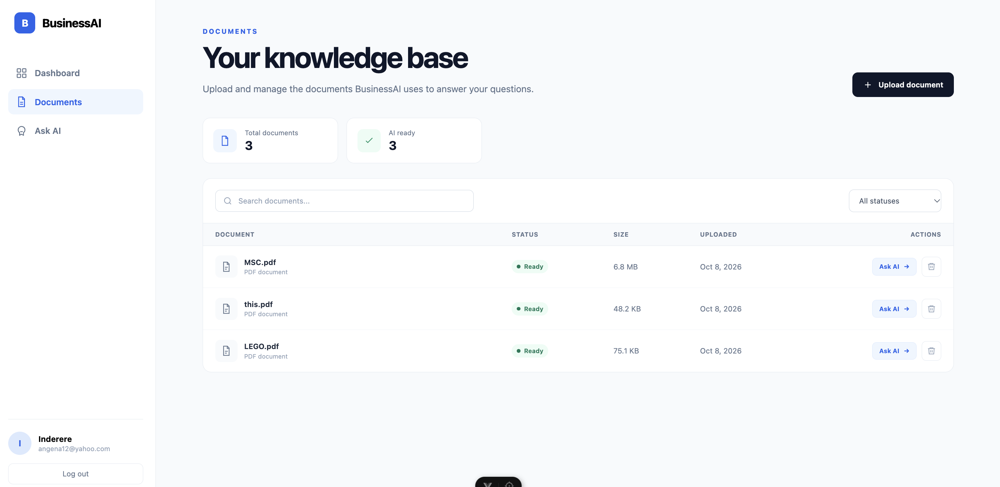
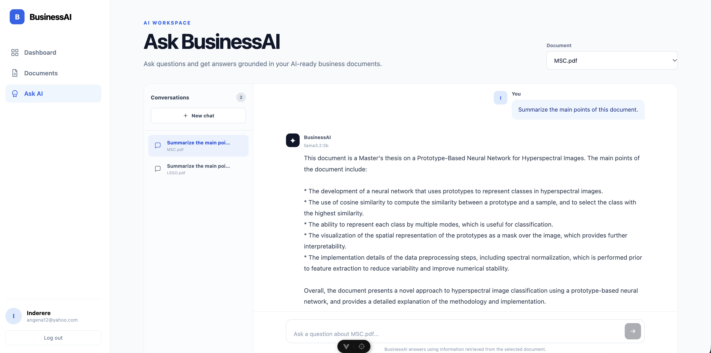
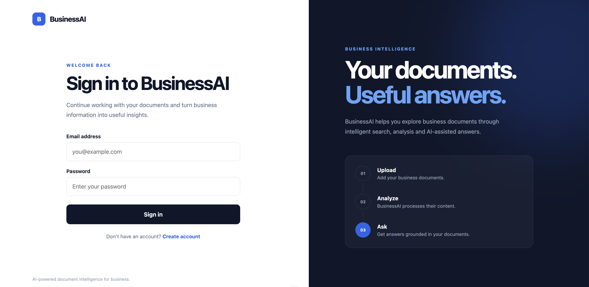
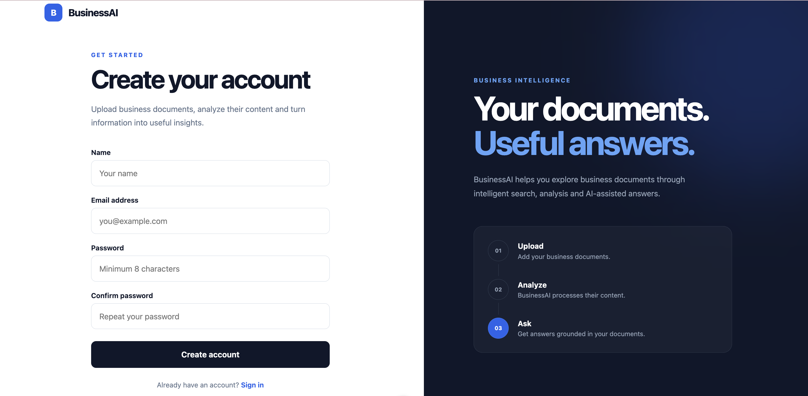

# BusinessAI

### AI-Powered Document Intelligence Platform

BusinessAI is a full-stack AI application that allows users to upload PDF documents, process their contents, and interact with them using natural language.

Built with Laravel, Vue.js, and Python FastAPI, BusinessAI uses Retrieval-Augmented Generation (RAG) to generate context-aware answers based on information extracted from uploaded documents.

The application combines modern web development with AI technologies to make document analysis more accessible and interactive.

---

## Features

### Authentication and User Management
- User registration and login
- Secure API authentication using Laravel Sanctum
- Protected application routes
- User-specific documents and conversations

### Document Management
- Upload PDF documents
- View and manage uploaded documents
- Track document processing status
- Search and filter documents
- Delete documents

### AI-Powered Document Analysis
- Extract text from uploaded PDF files
- Automatically split documents into smaller text chunks
- Generate vector embeddings using Sentence Transformers
- Perform semantic search to retrieve relevant information
- Generate AI responses using Retrieval-Augmented Generation (RAG)
- Ask follow-up questions with conversation context

### AI Conversation Management
- Create conversations associated with specific documents
- Save AI-generated responses and user questions
- Continue previous conversations
- View conversation history
- Delete conversations

### Dashboard
- View uploaded document statistics
- Monitor document processing
- Access recent documents
- Navigate directly to AI conversations

---

## Technology Stack

| Layer | Technologies |
|-------|-------------|
| Frontend | Vue 3, JavaScript, Pinia, Vue Router |
| Backend | Laravel 13, PHP |
| Authentication | Laravel Sanctum |
| AI Service | Python, FastAPI |
| Language Model | Llama 3.2 (3B) via Ollama |
| Embeddings | Sentence Transformers (all-MiniLM-L6-v2) |
| Database | Laravel-supported relational database |
| Document Processing | smalot/pdfparser |
| Background Jobs | Laravel Queues |
| Version Control | Git and GitHub |

---

## System Architecture

BusinessAI consists of three main services:

```text
                    USER
                     |
                     v
              Vue.js Frontend
                (Port 5173)
                     |
                     v
               Laravel API
                (Port 8000)
                     |
          +----------+----------+
          |                     |
          v                     v
      Database             Queue Worker
                                |
                                v
                         PDF Processing
                                |
                                v
                         Text Extraction
                                |
                                v
                         Text Chunking
                                |
                                v
                         FastAPI Service
                           (Port 8001)
                                |
                                v
                         Vector Embeddings
```

### AI Question-Answering Workflow

```text
User asks a question
         |
         v
Vue frontend sends request
         |
         v
Laravel API validates request
         |
         v
Relevant document chunks retrieved
using semantic similarity
         |
         v
Context sent to FastAPI
         |
         v
Llama 3.2 generates an answer
         |
         v
Laravel saves the conversation
         |
         v
Answer displayed in Vue
```

---

## Project Structure

```text
BusinessAI/
|
|-- businessai-api/        Laravel backend
|   |-- app/
|   |-- database/
|   |-- routes/
|   |-- composer.json
|
|-- businessai-web/        Vue.js frontend
|   |-- src/
|   |-- public/
|   |-- package.json
|
|-- businessai-ai/         Python AI service
|   |-- main.py
|   |-- requirements.txt
|
|-- README.md
|-- .gitignore
```

---

## Installation and Setup

### Prerequisites

Make sure you have the following installed:

- PHP and Composer
- Node.js and npm
- Python 3
- A supported relational database
- Ollama
- Git

### 1. Clone the repository

```bash
git clone https://github.com/angemarie0112/BusinessAI.git
cd BusinessAI
```

### 2. Configure the Laravel backend

```bash
cd businessai-api

composer install

cp .env.example .env

php artisan key:generate
```

Configure your database connection in `.env`.

Then run:

```bash
php artisan migrate
```

Start the Laravel server:

```bash
php artisan serve
```

The API will be available at:

`http://127.0.0.1:8000`

### 3. Start the Laravel queue worker

Open another terminal:

```bash
cd businessai-api

php artisan queue:work --memory=512
```

The queue worker processes uploaded PDF documents in the background.

### 4. Configure the Python AI service

Open another terminal:

```bash
cd businessai-ai

python3 -m venv .venv

source .venv/bin/activate

pip install -r requirements.txt
```

Start FastAPI:

```bash
uvicorn main:app --reload --port 8001
```

The AI service will be available at:

`http://127.0.0.1:8001`

### 5. Configure Ollama

Install Ollama and download the language model:

```bash
ollama pull llama3.2:3b
```

Ensure Ollama is running before using the AI features.

### 6. Configure the Vue frontend

Open another terminal:

```bash
cd businessai-web

npm install

npm run dev
```

Open the application:

`http://localhost:5173`

---

## Application Screenshots

### 1. Dashboard

The BusinessAI dashboard provides an overview of uploaded documents, processing status, and recent activity.


### 2. Document Management

Users can upload PDF documents, search and filter files, monitor processing status, and manage their documents.



### 3. AI-Powered Document Chat

BusinessAI uses Retrieval-Augmented Generation (RAG) to answer questions based on uploaded documents. Users can also ask follow-up questions and access previous conversations.



### 4. User Login

BusinessAI provides secure user authentication through Laravel Sanctum.



### 5. User Registration

New users can create accounts and access their own documents and AI conversations.



## Current Status

**BusinessAI V1 — Completed Local MVP**

The core features have been implemented and tested locally.

The application currently runs using separate Laravel, Vue.js, and Python services.

Production deployment and additional performance optimizations are planned for future versions.

---

## Future Improvements

- Production deployment
- Automated testing and CI/CD
- Improved error handling and monitoring
- Performance optimization for large documents
- Support for additional document formats
- More advanced document search and retrieval
- Improved AI response quality

---

## Author

**Marie Ange Ndagijimana**

Software Engineer | AI & Data Science

GitHub: [angemarie0112](https://github.com/angemarie0112)

---

## Project Purpose


- Full-stack application development
- REST API design
- Authentication and authorization
- Background job processing
- AI and machine learning integration
- Retrieval-Augmented Generation (RAG)
- Vector embeddings and semantic search
- Multi-service application architecture